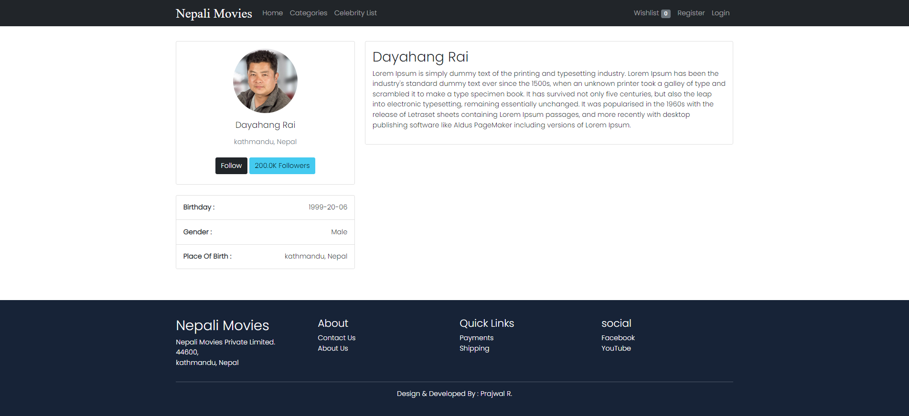

# Nepali Movies App
 A Full-Stack movies application that uses React, Redux, MongoDB, Nodejs, ExpressJS and JWT Authentication that allows user to upload and manage movies & celebrities.


<hr>

  [](https://github.com/Prajwal100)
  [](https://github.com/Prajwal100/Nepali_movies)
  [](https://github.com/Prajwal100/Nepali_movies)
  [](https://choosealicense.com/licenses/mit/)
  [](https://nodejs.org/en/)
  [](https://www.npmjs.com/package/inquirer)

  ## Table of Content
  * [ Project Links ](#Project-Links)
  * [ Screenshots-Demo ](#Screenshots-Demo)
  * [ Technologies ](#Technologies)
  * [ Installation ](#Installation)
  * [ Author Contact ](#Author-Contact)
  * [ License ](#License)
  #

  ##  Project Links
  
  ##### GitHub Repo link: https://github.com/Prajwal100/Nepali_movies/

  ## Screenshots-Demo
  <kbd></kbd><br>
  
  <kbd></kbd><br>
  
 <kbd></kbd><br>
  ## Technologies 
  
- [Node](https://nodejs.org/en/)

- [Express](https://expressjs.com/)

- [Mongoose](https://mongoosejs.com/)

- [React](https://reactjs.org/)

- [Redux](https://redux.js.org/)
  
  ## Installation
 #### Env Variables

Add your config variables values in the config.env file in backend/config folder

#### Install Dependencies (Frontend)

```
cd frontend
npm i
```

#### Install Dependencies (Backend)

```
npm i
```

#### Seed Database

Use the following commeand to put some dummy items in the database.
Run it in the root folder.

```
npm run seeder
```
  
  ## Author Contact
  Contact me with any questions!<br>

  Email: Prajwal.iar@gmail.com

  ## License
  This project is [MIT](https://choosealicense.com/licenses/mit/) licensed.<br />
<hr>
  Copyright © 2022 [Prajwal R.](https://raiprajwal.com/)

